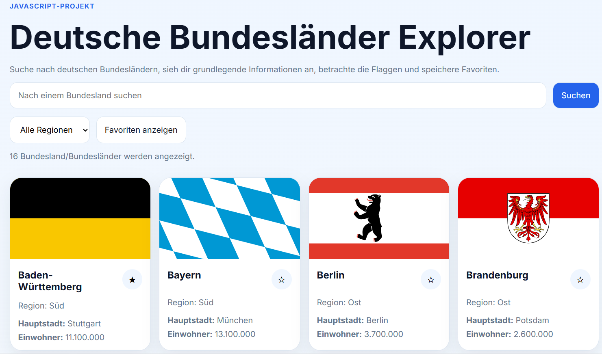
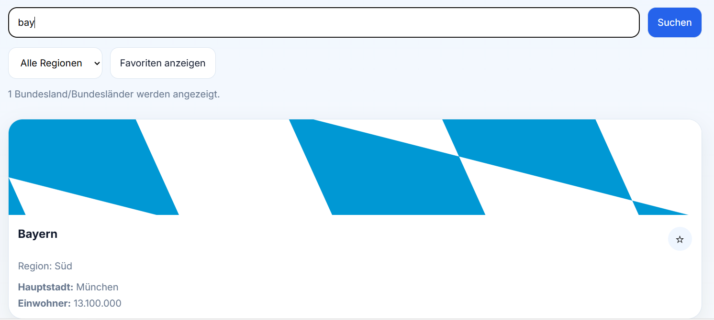
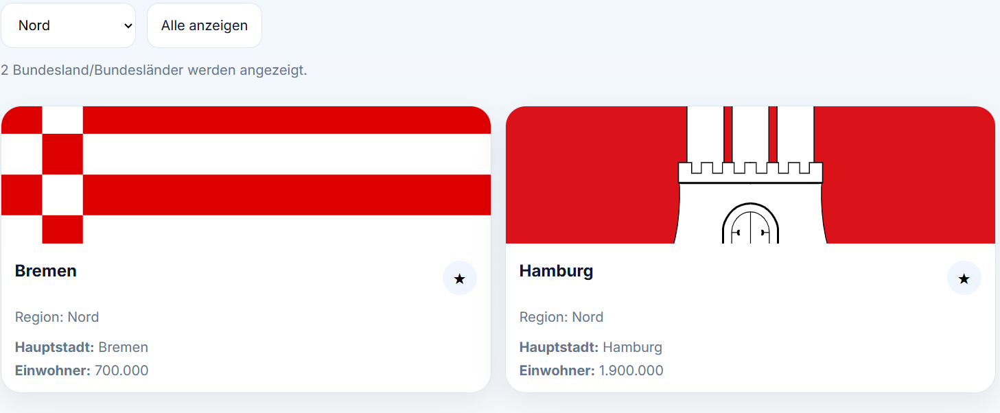

# Deutsche Bundesländer Explorer

Ein interaktives Webprojekt mit **HTML, CSS und JavaScript**, um deutsche Bundesländer zu suchen, nach Regionen zu filtern und Favoriten zu speichern.

---

## Funktionen

* Suche nach deutschen Bundesländern
* Filter nach Regionen (Nord, Süd, Ost, West)
* Anzeige von Hauptstadt, Einwohnerzahl und Flagge
* Favoriten speichern (LocalStorage)
* Responsives Design

---

## Technologien

* HTML5
* CSS3
* JavaScript
* LocalStorage

---

## Projektstruktur

```
German-States-Info/
├── index.html
├── style.css
├── script.js
├── README.md
└── screenshots/
    ├── startseite.png
    ├── suche.png
    └── favoriten.png
```

---

## Screenshots

### Startseite



### Suche



### Favoriten mit Sortierung nach Region



---

## Lernziele

* DOM-Manipulation
* Event Handling
* Arbeiten mit Arrays und Filtern
* LocalStorage
* Responsive Webdesign

---

## Autor

Ahmad Sajad Faiz
