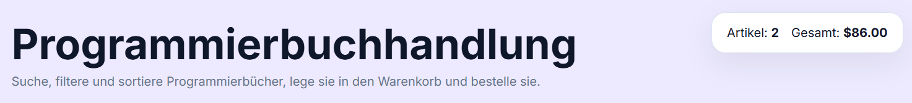
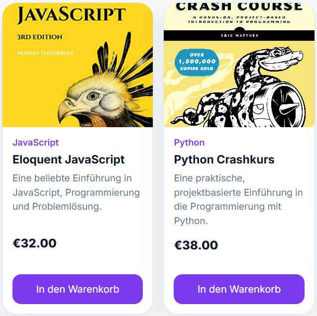
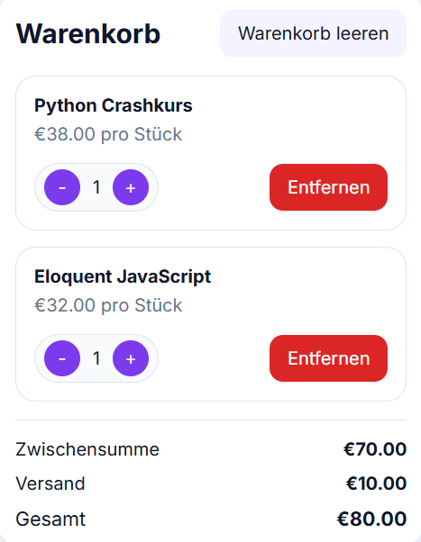
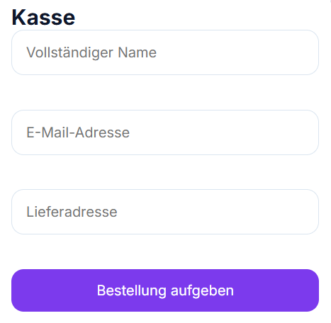
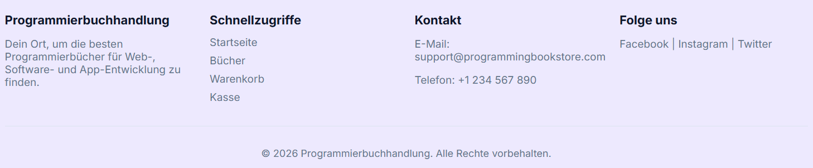
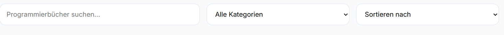
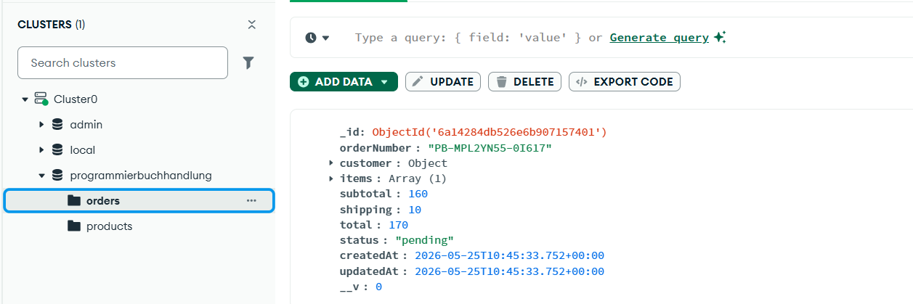

# Fullstack Programming Bookstore

Eine moderne Full-Stack-Webanwendung zum Durchsuchen, Filtern und Kaufen von Programmierbüchern.

Das Projekt wurde zuerst mit **JavaScript, HTML und CSS** entwickelt. Anschließend wurde die Anwendung in ein modernes **React/Vite-Frontend** umgewandelt. Zum Schluss wurde der Backend-Bereich mit **Node.js, Express und MongoDB** programmiert.

Produkte werden über die Backend-API geladen und Bestellungen werden in MongoDB gespeichert.

---

## Features

### Frontend

* Suche nach Büchern in Echtzeit
* Filter nach Kategorien
* Sortierung nach Titel und Preis
* Warenkorb-System
  * Produkte hinzufügen
  * Menge ändern
  * Produkte entfernen
  * Warenkorb leeren
* Automatische Preisberechnung
  * Zwischensumme
  * Versandkosten
  * Gesamtpreis
* Checkout-Formular mit Validierung
* Bestellbestätigung mit Bestellnummer
* Responsives Design für Desktop und mobile Geräte

### Backend

* Express REST API
* MongoDB Atlas Verbindung mit Mongoose
* Produktmodell
* Bestellmodell
* Produkte über API abrufen
* Einzelnes Produkt abrufen
* Bestellungen erstellen und in MongoDB speichern
* Serverseitige Validierung der Checkout-Daten
* Serverseitige Preisberechnung, damit Preise nicht vom Frontend manipuliert werden
* Seed-Script zum Importieren der Beispielprodukte

---

## Technologien

### Frontend

* React 18
* Vite
* JavaScript
* CSS3

### Backend

* Node.js
* Express
* MongoDB Atlas
* Mongoose
* Dotenv
* CORS
* Nodemon

---

## Projektstruktur

```text
programming-bookstore/
│── backend/
│   ├── config/
│   │   └── db.js
│   ├── controllers/
│   │   ├── orderController.js
│   │   └── productController.js
│   ├── data/
│   │   └── products.js
│   ├── middleware/
│   │   └── errorHandler.js
│   ├── models/
│   │   ├── Order.js
│   │   └── Product.js
│   ├── routes/
│   │   ├── orderRoutes.js
│   │   └── productRoutes.js
│   ├── .env
│   ├── package.json
│   ├── seed.js
│   └── server.js
│
│── frontend/
│   ├── src/
│   │   ├── components/
│   │   │   ├── CartPanel.jsx
│   │   │   ├── CheckoutPanel.jsx
│   │   │   ├── Footer.jsx
│   │   │   ├── Header.jsx
│   │   │   ├── ProductGrid.jsx
│   │   │   └── Toolbar.jsx
│   │   ├── data/
│   │   │   └── products.js
│   │   ├── services/
│   │   │   └── api.js
│   │   ├── styles/
│   │   ├── App.jsx
│   │   └── main.jsx
│   ├── .env
│   ├── index.html
│   ├── package.json
│   └── vite.config.js
│
│── images/
│── .gitignore
└── README.md
```

---

## Voraussetzungen

Installiere zuerst:

* Node.js
* npm
* MongoDB Atlas Account

---

## Installation

Repository klonen:

```bash
git clone https://github.com/SajadFaiz/web-entwicklung.git
cd web-entwicklung
```

Backend-Abhängigkeiten installieren:

```bash
cd backend
npm install
```

Frontend-Abhängigkeiten installieren:

```bash
cd ../frontend
npm install
```

---

## Umgebungsvariablen

### Backend

Erstelle im Ordner `backend` eine Datei `.env`:

```env
PORT=5000
MONGO_URI=deine_mongodb_atlas_connection_string
FRONTEND_URL=http://localhost:5173
NODE_ENV=development
```

### Frontend

Erstelle im Ordner `frontend` eine Datei `.env`:

```env
VITE_API_URL=http://localhost:5000/api
```

---

## Datenbank mit Produkten füllen

Nachdem die Backend-`.env` erstellt wurde, kannst du die Beispielprodukte in MongoDB importieren:

```bash
cd backend
npm run seed
```

---

## Projekt starten

Starte zuerst das Backend:

```bash
cd backend
npm run dev
```

Backend läuft standardmäßig auf:

```text
http://localhost:5000
```

Starte danach das Frontend in einem zweiten Terminal:

```bash
cd frontend
npm run dev
```

Frontend läuft standardmäßig auf:

```text
http://localhost:5173
```

---

## API-Endpunkte

### Health Check

```http
GET /api/health
```

### Alle Produkte abrufen

```http
GET /api/products
```

### Einzelnes Produkt abrufen

```http
GET /api/products/:id
```

### Bestellung erstellen

```http
POST /api/orders
```

### Bestellungen abrufen

```http
GET /api/orders
```
---

## Screenshots

### Header

Der Header zeigt den Titel der Anwendung sowie eine kurze Beschreibung und eine Übersicht des Warenkorbs mit Anzahl der Artikel und Gesamtpreis.



---

### Bücher

In diesem Bereich werden alle verfügbaren Programmierbücher angezeigt.
Jedes Buch enthält Kategorie, Titel, Beschreibung, Preis und eine Schaltfläche zum Hinzufügen in den Warenkorb.



---

### Warenkorb

Der Warenkorb zeigt alle ausgewählten Produkte.
Hier können Benutzer die Menge ändern, Artikel entfernen und die aktuellen Preise einsehen.



---

### Checkout

Das Checkout-Formular ermöglicht die Eingabe von persönlichen Daten wie Name, E-Mail und Adresse.
Nach dem Absenden wird die Bestellung über die Backend-API in MongoDB gespeichert.



---

### Footer

Der Footer enthält zusätzliche Informationen zur Anwendung, Kontaktmöglichkeiten sowie Navigationslinks.



---

### Suche und Filter

Mit der Such- und Filterfunktion können Benutzer gezielt nach Büchern suchen, Kategorien auswählen und die Ergebnisse sortieren.



---

## MongoDB-Bestelltest

Nach dem Absenden einer Bestellung über die Checkout-Seite wird die Bestellung erfolgreich in MongoDB Atlas gespeichert.

Die Bestellung befindet sich in der Datenbank `programmierbuchhandlung` in der Collection `orders`.



---

## Sicherheitshinweise

* `.env` darf niemals in GitHub gepusht werden.
* `MONGO_URI` muss geheim bleiben.
* Die Preisberechnung erfolgt im Backend anhand der Produktdatenbank.

---

## Autor

Ahmad Sajad Faiz
