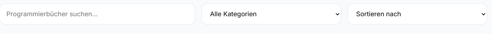

# Online-Programmierbuchhandlung

Eine moderne Webanwendung zum Durchsuchen, Filtern und Kaufen von Programmierbüchern.
Dieses Projekt wurde mit HTML, CSS und JavaScript entwickelt und demonstriert grundlegende E-Commerce-Funktionalitäten.

---

## Features

* Suche nach Büchern in Echtzeit
* Filter nach Kategorien
* Sortierung (A-Z, Preis auf-/absteigend)
* Warenkorb-System

  * Produkte hinzufügen
  * Menge ändern
  * Produkte entfernen
* Automatische Preisberechnung

  * Zwischensumme
  * Versandkosten
  * Gesamtpreis
* Checkout-Formular mit Validierung
* Bestellbestätigung nach erfolgreichem Kauf
* Responsives Design (auch für mobile Geräte)

---

## Ziel des Projekts

Dieses Projekt dient, um Kenntnisse in:

* Frontend-Entwicklung
* DOM-Manipulation
* Benutzerinteraktion
* UI/UX Design

zu demonstrieren.

---

## Screenshots

### Header


### Bücher


### Warenkorb


### Checkout


### Footer


### Suche und Filter



---

## Technologien

* HTML5
* CSS3 (Flexbox und Grid)
* JavaScript (Vanilla JS)

---

## Projektstruktur

```text
project-folder/
│── images/
│   ├── search-filter.png
│   ├── books.png
│   ├── cart.png
│   ├── checkout.png
│   ├── header.png
│   └── footer.png
│── index.html
│── styles.css
│── script.js
│── README.md
```

---

## Repository klonen

```bash
git clone https://github.com/SajadFaiz/web-entwicklung.git
```

---

## Autor 

Ahmad Sajad Faiz

---
