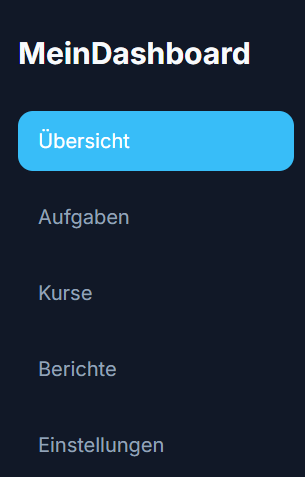
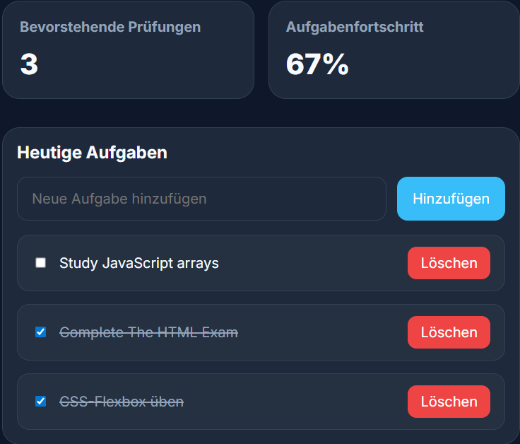
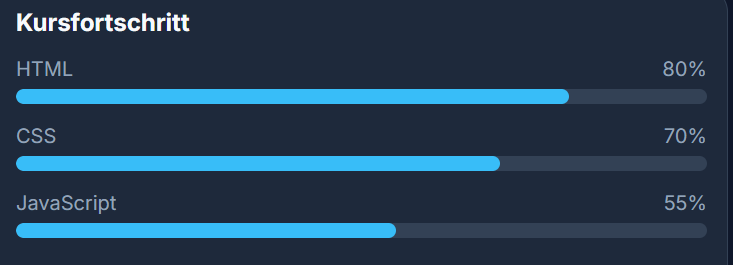
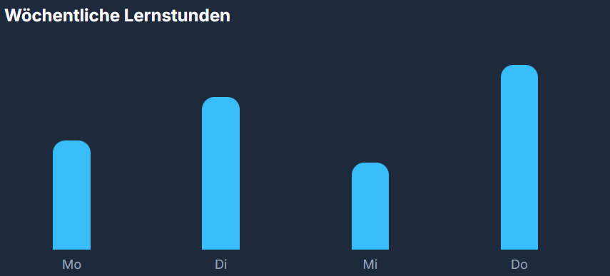
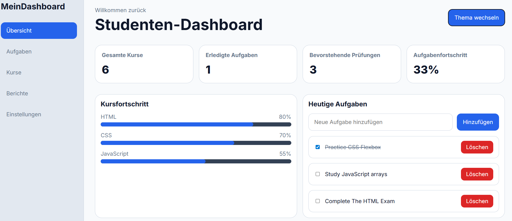

# Studenten-Dashboard

Ein modernes und responsives Studenten-Dashboard, entwickelt mit HTML, CSS und JavaScript.  
Die Anwendung hilft dabei, Aufgaben zu verwalten, Fortschritte zu verfolgen und Lernzeiten zu visualisieren.

---

## Funktionen

- Übersicht mit wichtigen Kennzahlen
- Aufgaben hinzufügen, abhaken und löschen sowie den Fortschritt automatisch anzeigen
- Berechnung des Fortschritts
- Hell-/Dunkelmodus (wird gespeichert)
- Datenspeicherung mit LocalStorage
- Anzeige der wöchentlichen Lernstunden

---

## Verwendete Technologien

- HTML5
- CSS3 (mit Variablen)
- JavaScript (Vanilla)
- LocalStorage API

---

## Screenshots

### Dashboard


### Aufgaben


### Kursfortschritt


### Wochenübersicht


### Dunkelmodus


---

## Autor

Ahmad Sajad Faiz

---

## Anwendung starten

1. Repository klonen:
```bash
git clone https://github.com/SajadFaiz/web-entwicklung.git
