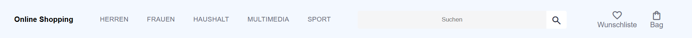
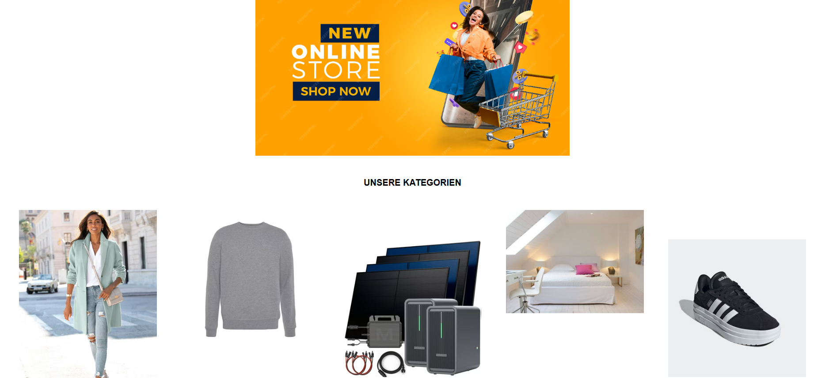
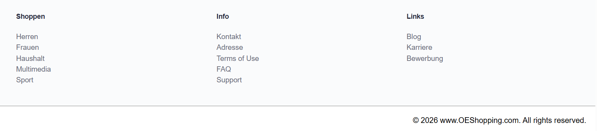

# Online Shopping Landing Page mit HTML und CSS

Dies ist eine einfache Online-Shopping-Landing-Page, die mit HTML und CSS erstellt wurde.

Das Ziel dieses Projekts war es, den Aufbau einer Webseite, das Styling, Abstände und das Layout für ein Frontend-Projekt zu üben.

## Verwendete Technologien
- HTML5
- CSS3

## Aufbau der Webseite

### Header
Der Header enthält:
- den Titel der Webseite
- eine Navigationsleiste
- eine Suchleiste
- ein Wunschlisten-Icon
- ein Bag-Icon

### Header

### Main-Bereich
Der Main-Bereich enthält:
- ein Bannerbild
- eine Überschrift für die Kategorien
- Bilder für verschiedene Shopping-Kategorien:
  - Frauen
  - Herren
  - Multimedia
  - Haushalt
  - Sport

### Main-Bereich

### Footer
Der Footer enthält:
- Shopping-Links
- Informations-Links
- weitere nützliche Links
- Copyright-Text

### Footer

## Aktuelle Funktionalität
Dieses Projekt ist aktuell eine statische Landing Page, die mit HTML und CSS erstellt wurde.

Sie enthält:
- eine strukturierte Seitenaufteilung
- ein Navigationsmenü
- eine Suchleisten-Oberfläche
- einen Kategorien-Bereich
- gruppierte Footer-Links
- ein Layout mit Flexbox

## Was kann man mit dem Projekt lernen
Mit diesem Projekt kann man üben:
- eine Webseite mit HTML zu strukturieren
- mit CSS zu stylen
- Flexbox für Layouts zu verwenden
- Bilder und Ordner sinnvoll zu organisieren
- eine Shopping-Landing-Page von Grund auf selbst zu erstellen

## Zukünftige Verbesserungen
In der nächsten Version kann man:
- JavaScript-Funktionalitäten hinzufügen
- Produktkarten erstellen
- eine Warenkorb-Logik einbauen
- die Responsivität verbessern
- das Projekt später mit React neu aufbauen