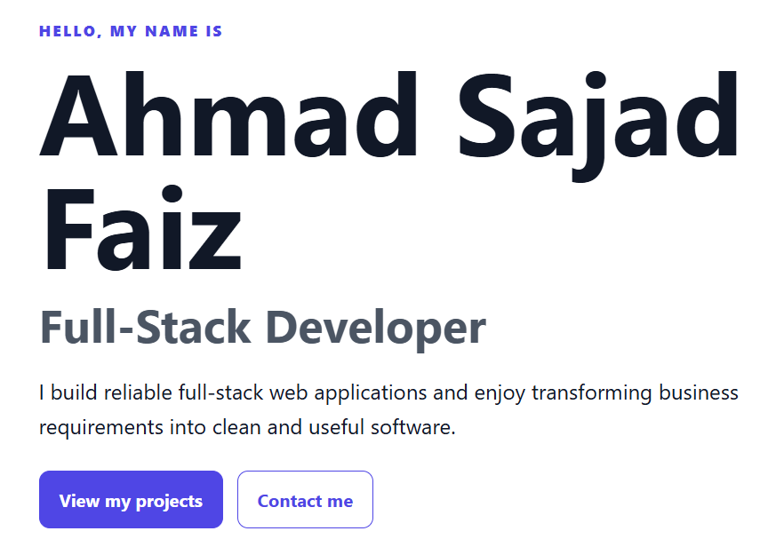
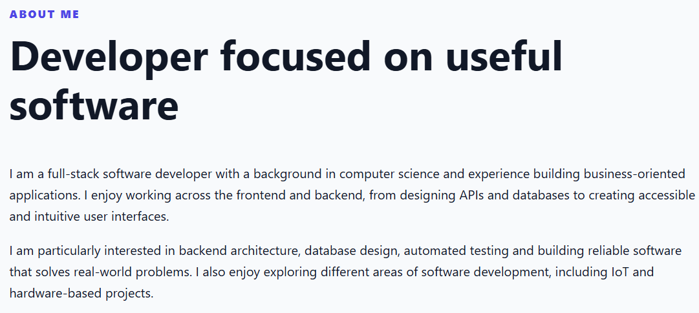
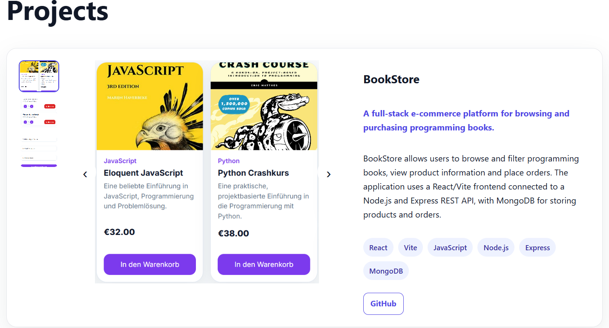
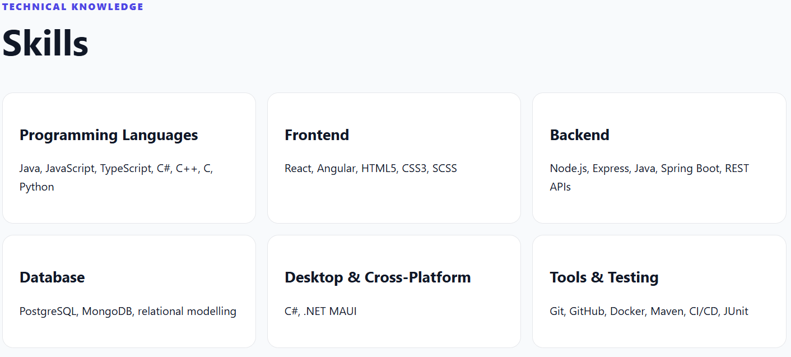
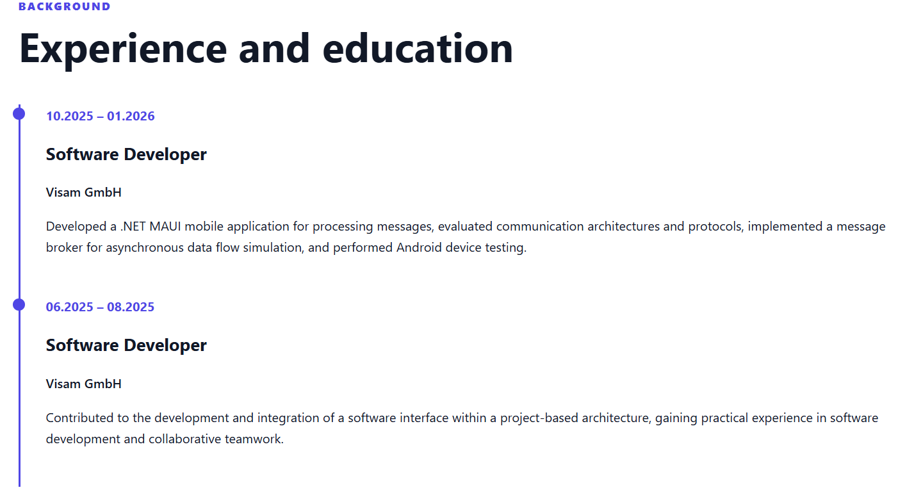
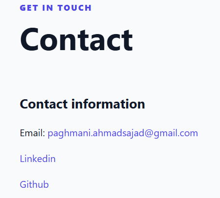
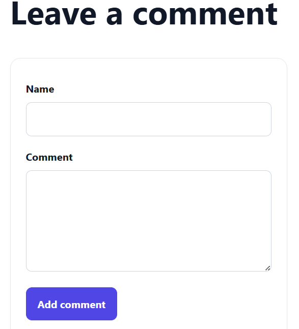

# Full-Stack-Developer-Portfolio

Ein responsives Entwickler-Portfolio, erstellt mit Angular, Spring Boot und PostgreSQL.

Die Website präsentiert persönliche Informationen, technische Fähigkeiten, Berufserfahrung, Ausbildung sowie vier Portfolio-Projekte. Besucher können Projektscreenshots ansehen, Live-Demos öffnen, GitHub-Repositories besuchen, Kontaktanfragen senden und Kommentare hinterlassen.

## Funktionen

- Home-Bereich mit Entwicklername, Rolle und persönlicher Vorstellung
- „Über mich“-Bereich
- Vier detaillierte Portfolio-Projekte
- Projekt-Screenshot-Galerien im Amazon-Stil
- Übersicht über Technologien und Fähigkeiten
- Zeitstrahl für Berufserfahrung und Ausbildung
- Kontaktinformationen
- Kontaktformular mit Backend-Anbindung
- Öffentliche Besucherkommentare
- Anzeige des Lebenslaufs mit Download-Button
- Responsives Layout
- Validierung im Backend
- Persistenz mit PostgreSQL
- Datenbankmigrationen mit Flyway
- Docker- und Docker-Compose-Konfiguration

## Technologien

### Frontend

- Angular 22
- TypeScript
- Angular Reactive Forms
- Angular HttpClient
- HTML
- SCSS

### Backend

- Java 21
- Spring Boot 4.1
- Spring Web
- Spring Data JPA
- Jakarta Validation
- Flyway
- Maven

### Datenbank und Tools

- PostgreSQL 18
- Docker
- Docker Compose
- Git

### Entwicklungswerkzeuge

- Git
- GitHub
- Maven
- npm
- Docker

### Projektstruktur

```text
portfolio-project/
├── frontend/
├── backend/
├── docs/
├── docker-compose.yml
├── README.md
...
```

## Screenshots

### Home

Dieser Bereich bietet einen Überblick über das Portfolio und präsentiert die verfügbaren Abschnitte, darunter persönliche Informationen, Fähigkeiten, Projekte, Berufserfahrung, Ausbildung und Kontaktmöglichkeiten.



---

### About

Dieser Bereich enthält Informationen über den beruflichen Hintergrund, persönliche Interessen, den Entwicklungsansatz sowie die fachlichen Spezialisierungen.



---

### Projekte

Dieser Bereich präsentiert vier Softwareprojekte. Jedes Projekt enthält einen Titel, eine Beschreibung, die verwendeten Technologien, Projektscreenshots sowie einen Link zum entsprechenden GitHub-Repository.



---

### Skills

Der Bereich „Skills“ gibt einen Überblick über die wichtigsten Technologien und Entwicklungswerkzeuge, die bei den Projekten verwendet wurden.



---

### Berufserfahrung & Ausbildung

Dieser Bereich präsentiert relevante Berufserfahrungen, Praktika, Kurse, Ausbildungsabschnitte, Zertifizierungen und weitere technische Qualifikationen.



---

### Kontakt

Der Kontaktbereich enthält Informationen zu E-Mail, LinkedIn und GitHub sowie ein Kontaktformular.

Nachrichten, die über das Kontaktformular gesendet werden, werden an das Spring-Boot-Backend übermittelt und in PostgreSQL gespeichert.



---

### Kommentare

Das Portfolio verfügt über eine Funktion für Besucherkommentare.

Besucher können über das Frontend Kommentare hinterlassen. Das Spring-Boot-Backend verarbeitet die Anfragen und speichert die Kommentare in PostgreSQL.



---

Repository klonen:

```bash
git clone https://github.com/SajadFaiz/web-entwicklung.git
cd web-entwicklung
```

### Autor
Ahmad Sajad Faiz


