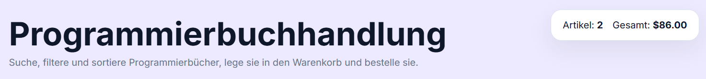
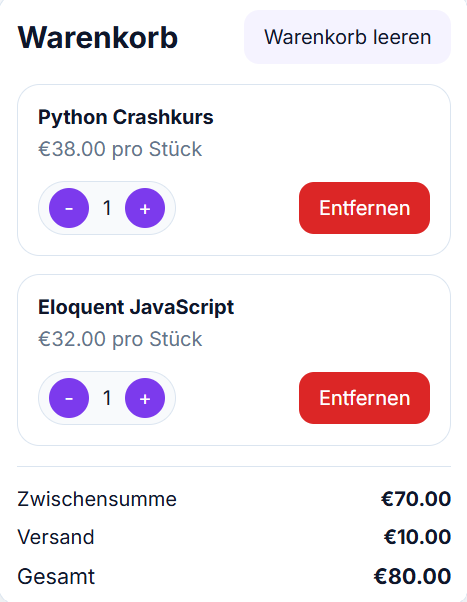
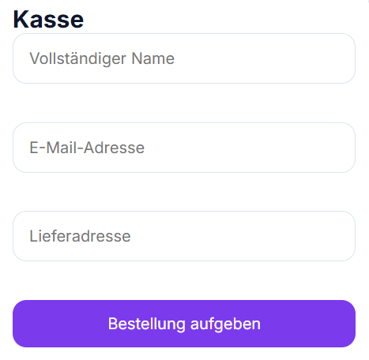

# React Programmierbuchhandlung

Eine moderne Webanwendung zum Durchsuchen, Filtern und Kaufen von Programmierbüchern.
Dieses Projekt wurde mit **React (Vite)** und CSS entwickelt und demonstriert grundlegende E-Commerce-Funktionalitäten.

---

## Features

* Suche nach Büchern in Echtzeit
* Filter nach Kategorien
* Sortierung (A-Z, Preis auf-/absteigend)
* Warenkorb-System

  * Produkte hinzufügen
  * Menge ändern
  * Produkte entfernen
* Automatische Preisberechnung

  * Zwischensumme
  * Versandkosten
  * Gesamtpreis
* Checkout-Formular mit Validierung
* Bestellbestätigung nach erfolgreichem Kauf
* Responsives Design (auch für mobile Geräte)

---

## Ziel des Projekts

Dieses Projekt dient dazu, Kenntnisse in:

* React (Komponentenstruktur)
* State Management (useState)
* Benutzerinteraktion
* UI/UX Design

zu demonstrieren.

---

## Screenshots

### Header

Der Header zeigt den Titel der Anwendung sowie eine kurze Beschreibung und eine Übersicht des Warenkorbs mit Anzahl der Artikel und Gesamtpreis.



---

### Bücher

In diesem Bereich werden alle verfügbaren Programmierbücher angezeigt.
Jedes Buch enthält Kategorie, Titel, Beschreibung, Preis und eine Schaltfläche zum Hinzufügen in den Warenkorb.


---

### Warenkorb

Der Warenkorb zeigt alle ausgewählten Produkte.
Hier können Benutzer die Menge ändern, Artikel entfernen und die aktuellen Preise einsehen.



---

### Checkout


Das Checkout-Formular ermöglicht die Eingabe von persönlichen Daten wie Name, E-Mail und Adresse.
Zusätzlich erfolgt eine Validierung der Eingaben vor dem Absenden der Bestellung.



---

### Footer

Der Footer enthält zusätzliche Informationen zur Anwendung, Kontaktmöglichkeiten sowie Navigationslinks.


---

### Suche und Filter

Mit der Such- und Filterfunktion können Benutzer gezielt nach Büchern suchen, Kategorien auswählen und die Ergebnisse sortieren.


---

## Technologien

* React (mit Vite)
* JavaScript (ES6+)
* CSS3 (Flexbox und Grid)

---

## Projektstruktur

```text
react-programmierbuchhandlung/
│── images/
│   ├── search-filter.png
│   ├── books.png
│   ├── cart.png
│   ├── checkout.png
│   ├── header.png
│   └── footer.png
│── src/
│   ├── components/
│   ├── data/
│   ├── styles/
│   ├── App.jsx
│   └── main.jsx
│── index.html
│── package.json
│── README.md
```

---

## Projekt starten

```bash
npm install
npm run dev
```

---

## Repository klonen

```bash
git clone https://github.com/SajadFaiz/web-entwicklung.git
```

---

## Autor

Ahmad Sajad Faiz

---
